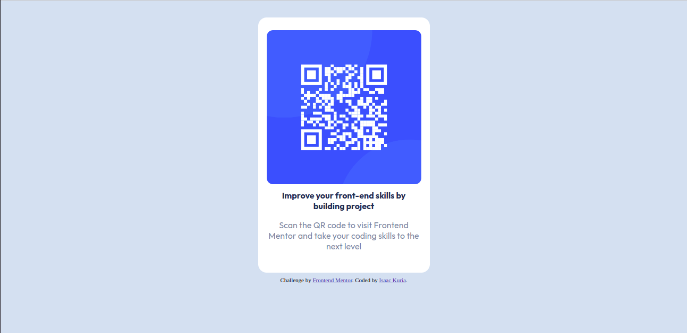

# Frontend Mentor - QR code component solution

This is a solution to the [QR code component challenge on Frontend Mentor](https://www.frontendmentor.io/challenges/qr-code-component-iux_sIO_H). Frontend Mentor challenges help you improve your coding skills by building realistic projects.

## Table of contents

- [Overview](#overview)
  - [Screenshot](#screenshot)
  - [Links](#links)
- [My process](#my-process)
  - [Built with](#built-with)
  - [What I learned](#what-i-learned)
  - [Continued development](#continued-development)
- [Author](#author)

## Overview

Challenge is to recreate this website of a QR only using HTML5 and CSS3

### Screenshot

### Links

- Solution URL: [Add solution URL here](https://github.com/kabszac/qr-component)
- Live Site URL: [Add live site URL here](https://your-live-site-url.com)

### Built with

- Semantic HTML5 markup
- CSS custom properties
- Flexbox

### What I learned

I learnt how to use css variables and improved my undersatading on web responsiveness.

### Continued development

Building functional and responsive websites

## Author

- Website - [Isaac Kuria](https://www.your-site.com)
- Frontend Mentor - [@kabszac](https://www.frontendmentor.io/profile/yourusername)
- Twitter - [@yourusername](https://www.twitter.com/yourusername)
